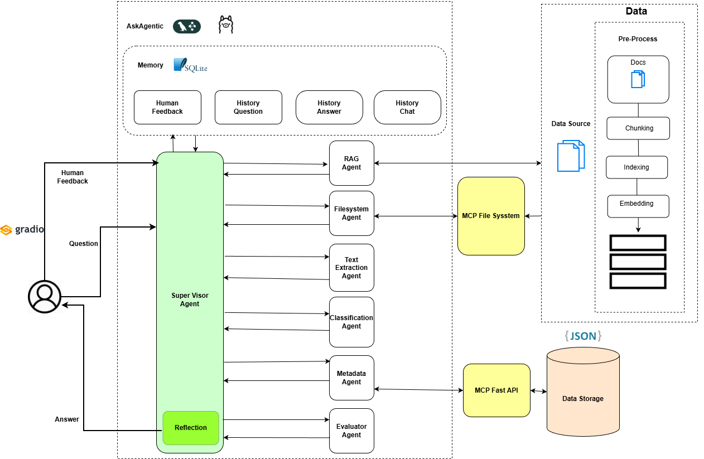

# 🤖 Multi-Agent AI Chatbot

An advanced AI-powered chatbot system with multi-agent architecture, RAG capabilities, and role-based access control.

## ✨ Features

- 🧠 **Multi-Agent System**: Specialized agents for different tasks (RAG, File Classification, Data Analysis, Metadata, Filesystem)
- 🔍 **RAG (Retrieval-Augmented Generation)**: Search and query documents using Google Generative AI embeddings
- 📁 **File Upload**: Upload and process documents (PDF, DOCX, PPTX, TXT, CSV, XLSX)
- 🔐 **Authentication**: Secure login with role-based access control
- 🎨 **Modern UI**: Beautiful gradient interface with real-time processing visualization
- 🌐 **Local & Cloud LLMs**: Support for both Ollama (local) and Google Gemini (cloud)
- 📊 **Chain of Thought**: Transparent AI reasoning process display
- 🔒 **Security**: Environment-based configuration, password hashing, secure file handling


## System rchitecture:



## 🚀 Quick Start

### Prerequisites

- Python 3.10+
- Node.js 18+
- Ollama (for local models)
- Google API Key (for Gemini)

### Installation

1. **Clone the repository**
   ```bash
   git clone <repository-url>
   cd agentic-assistant
   ```

2. **Install dependencies**
   ```bash
   pip install -r requirements.txt
   npm install
   ```

3. **Configure environment**
   ```bash
   cp .env.example .env
   # Edit .env and add your GOOGLE_API_KEY and other settings
   ```

4. **Install Ollama models**
   ```bash
   ollama pull mistral
   ```

5. **Run the application**
   ```bash
   python app.py
   ```

6. **Access the application**
   - Open browser: `http://localhost:7860`
   - Login with credentials from your `.env` file

## 📖 Documentation

- **[Deployment Guide](DEPLOYMENT.md)** - Complete deployment instructions for local, production, Docker, and cloud
- **[Security Guide](SECURITY.md)** - Security features, best practices, and incident response
- **[.env.example](.env.example)** - Environment variable template

## 🔐 Security

**IMPORTANT**: Before deploying to production:

1. ✅ Change default admin password in `.env`
2. ✅ Generate secure `APP_SECRET_KEY`
3. ✅ Set `DEBUG_MODE=False`
4. ✅ Configure HTTPS
5. ✅ Review [SECURITY.md](SECURITY.md)

## 🏗️ Architecture

```
agentic-assistant/
├── agents/              # AI agents (RAG, Classification, Analysis, etc.)
├── config/              # Configuration (LLM, prompts, security)
├── utils/               # Utilities (file upload, logging, access control)
├── data/                # Uploaded documents
├── logs/                # Application logs
├── vector_store_google/ # Vector database cache
├── app.py               # Main application
└── requirements.txt     # Python dependencies
```

## 🤝 Contributing

Contributions are welcome! Please:

1. Fork the repository
2. Create a feature branch
3. Make your changes
4. Submit a pull request

## 📝 License

[Your License Here]

## 🆘 Support

For issues and questions:
- Check [DEPLOYMENT.md](DEPLOYMENT.md) for deployment help
- Review [SECURITY.md](SECURITY.md) for security concerns
- Check application logs in `logs/` directory

## 🙏 Acknowledgments

- Built with [Gradio](https://gradio.app/)
- Powered by [LangChain](https://langchain.com/) and [LangGraph](https://langchain-ai.github.io/langgraph/)
- Uses [Google Gemini](https://ai.google.dev/) and [Ollama](https://ollama.ai/)
- Vector search with [ChromaDB](https://www.trychroma.com/)