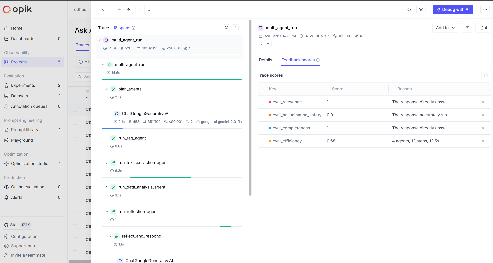

# Ask Agentic — Multi-Agent Document Intelligence Platform

> **One-liner:** An AI-powered multi-agent system that autonomously finds, extracts, classifies, and analyzes documents — with full observability via Opik.


**Live Demo:** *(Gradio share link)*  
**Demo Video:** *(3-min video link)*

---

## The Problem

Knowledge workers spend **~20% of their workweek** searching for, reading, and comparing documents. Financial analysts manually extract numbers from PDFs, compare year-over-year metrics, and classify reports — repetitive tasks that are slow, error-prone, and mind-numbing.

## The Solution

**Ask Agentic** is a multi-agent AI assistant that turns hours of manual document work into seconds. Ask a question in natural language, and a team of specialized AI agents collaborates to:

1. **Find** the right files on your filesystem
2. **Extract** text and data from PDFs, DOCX, PPTX, CSV, XLSX
3. **Classify** documents by type (financial report, invoice, contract, etc.)
4. **Analyze** and compare data across multiple documents with markdown tables
5. **Save metadata** for instant future retrieval via RAG search

All orchestrated by an intelligent planner that decides which agents to deploy and in what order.


---

## Key Features

### Multi-Agent Orchestration
- **7 specialized agents**: Filesystem, RAG, Text Extraction, File Classification, Data Analysis, Metadata, Reflection
- **LLM-powered planner** that dynamically selects and sequences agents based on the query
- **Evaluator loop** that checks if the task is complete before returning results
- **Human-in-the-loop feedback** for correcting classifications and guiding agent behavior

### Document Intelligence
- **PDF/DOCX/PPTX/CSV/XLSX** support with robust text extraction (PyMuPDF + fallbacks)
- **RAG search** over document contents using Google Gemini embeddings + ChromaDB
- **Financial data comparison** — e.g., "Compare revenue between 2023 and 2024" produces structured markdown tables
- **Anti-hallucination guards** — reflection agent validates data before summarizing

### Opik Integration (Evaluation & Observability)

This is where Ask Agentic stands out. We don't just trace LLM calls — we systematically evaluate every response.

#### Tracing & Spans
- **`OpikTracer`** callback on every Gemini LLM call — auto-traces all LangChain invocations
- **`@opik_track`** decorator on 11 key methods (planner, evaluator, each agent runner, reflection, main run)
- **Unified project routing** — custom wrapper ensures all spans land in the same Opik project, eliminating nested-span warnings

#### Online LLM-as-Judge Evaluations
After every user query, 4 evaluation metrics run **automatically in parallel**:

| Metric | What it measures | Method |
|--------|-----------------|--------|
| **Relevance** | Does the response address the query? | LLM-as-judge (Gemini) |
| **Completeness** | Are all aspects of the question answered? | LLM-as-judge (Gemini) |
| **Hallucination Safety** | Does the response stick to available data? | LLM-as-judge + agent data cross-check |
| **Efficiency** | Were the right agents used in minimal time? | Heuristic (agent count + response time) |

Scores are:
- Displayed as **visual quality bars** in the Processing Pipeline UI panel
- Logged as **Opik feedback scores** on each trace for dashboard analysis

#### Offline Experiment Tracking
- **Benchmark dataset** with 6 test cases covering file search, data analysis, classification, extraction, RAG, and full pipeline
- **3 custom scoring functions**: Agent Selection (F1 of expected vs actual agents), Task Completion, Response Time
- Run `python -m config.opik_eval` to execute experiments and compare prompt/model versions in the Opik dashboard

## Opik Dashboard

Full trace tree with feedback scores (relevance, completeness, hallucination safety, efficiency) logged automatically after every query:



---
#### What Judges Can See in Opik Dashboard
- Full trace trees for every query (planner → agents → evaluator → reflection)
- Per-trace feedback scores (relevance, completeness, hallucination safety, efficiency)
- Experiment comparisons across runs
- Token usage and latency metrics per agent

### Modern UI
- **Gradio** web interface with dark theme
- **Real-time Processing Pipeline** showing chain-of-thought steps as agents execute
- **Quality Score bars** displayed after each response (powered by Opik evals)
- **Role-based access control** with secure authentication

---


## Quick Start

### Prerequisites
- Python 3.10+
- [Google API Key](https://ai.google.dev/) (for Gemini 2.0 Flash)
- [Opik API Key](https://www.comet.com/site/products/opik/) (free — for observability)

### Installation

```bash
# Clone the repository
git clone https://github.com/ddhuu/agentic-assistant.git
cd agentic-assistant

# Install dependencies
pip install -r requirements.txt
npm install

# Configure environment
cp .env.example .env
# Edit .env and add your GOOGLE_API_KEY, OPIK_API_KEY, OPIK_WORKSPACE
```

### Run

```bash
python app.py
```

Open `http://localhost:7860` in your browser. Login with credentials from your `.env` file.

### Run Offline Evaluation Experiment

```bash
python -c "import asyncio; from config.opik_eval import run_experiment; from agents.multi_agents import MultiAgentSystem; mas = MultiAgentSystem(); asyncio.run(mas.initialize()); asyncio.run(run_experiment(mas, experiment_name='baseline-v1'))"
```

View results at [Opik Dashboard](https://www.comet.com/opik).

---

## Project Structure

```
agentic-assistant/
├── agents/
│   ├── multi_agents.py          # Core orchestration (planner, evaluator, agent runners)
│   ├── rag_agent.py             # RAG search with Gemini embeddings + ChromaDB
│   ├── data_analysis_agent.py   # Financial data extraction & comparison
│   ├── filesystem_agent.py      # File discovery via MCP
│   ├── text_extraction_agent.py # PDF/DOCX/PPTX text extraction
│   ├── file_classification_agent.py  # Document type classification
│   ├── metadata_agent.py        # Metadata extraction & storage
│   └── human_feedback_agent.py  # Human-in-the-loop corrections
├── config/
│   ├── llm.py                   # LLM setup + OpikTracer callback
│   ├── opik_eval.py             # Evaluation metrics, experiments, scoring
│   ├── prompt.py                # Agent system prompts
│   └── security.py              # Auth & security config
├── app.py                       # Gradio UI + chat logic
├── requirements.txt
└── .env.example
```

---

## Tech Stack

| Component | Technology |
|-----------|-----------|
| **LLM** | Google Gemini 2.0 Flash |
| **Orchestration** | LangChain + LangGraph |
| **Embeddings** | Gemini Embedding 001 (3072-dim) |
| **Vector Store** | ChromaDB |
| **File Access** | MCP (Model Context Protocol) |
| **Observability** | Opik by Comet |
| **UI** | Gradio 4.x |
| **Document Processing** | PyMuPDF, python-docx, python-pptx, openpyxl |

---

## Example Queries

| Query | Agents Used | What Happens |
|-------|------------|--------------|
| "Find finance2023.pdf" | Filesystem | Searches local filesystem via MCP |
| "What is the total revenue for 2023?" | RAG | Semantic search over indexed documents |
| "Compare financial data between 2023 and 2024" | RAG → TextExtraction → DataAnalysis → Reflection | Full pipeline: find, extract, compare, summarize |
| "Classify finance2024.pdf" | Filesystem → FileClassification | Finds file, then classifies document type |
| "Save metadata for all financial reports" | Filesystem → TextExtraction → Classification → Metadata | Full document processing pipeline |

---


## Team

- **ddhuu** — Software Engineer

## License

MIT

## Acknowledgments

- [Opik by Comet](https://www.comet.com/site/products/opik/) — LLM observability & evaluation
- [LangChain](https://langchain.com/) & [LangGraph](https://langchain-ai.github.io/langgraph/) — Agent orchestration
- [Google Gemini](https://ai.google.dev/) — LLM & embeddings
- [Gradio](https://gradio.app/) — Web UI framework
- [ChromaDB](https://www.trychroma.com/) — Vector search
